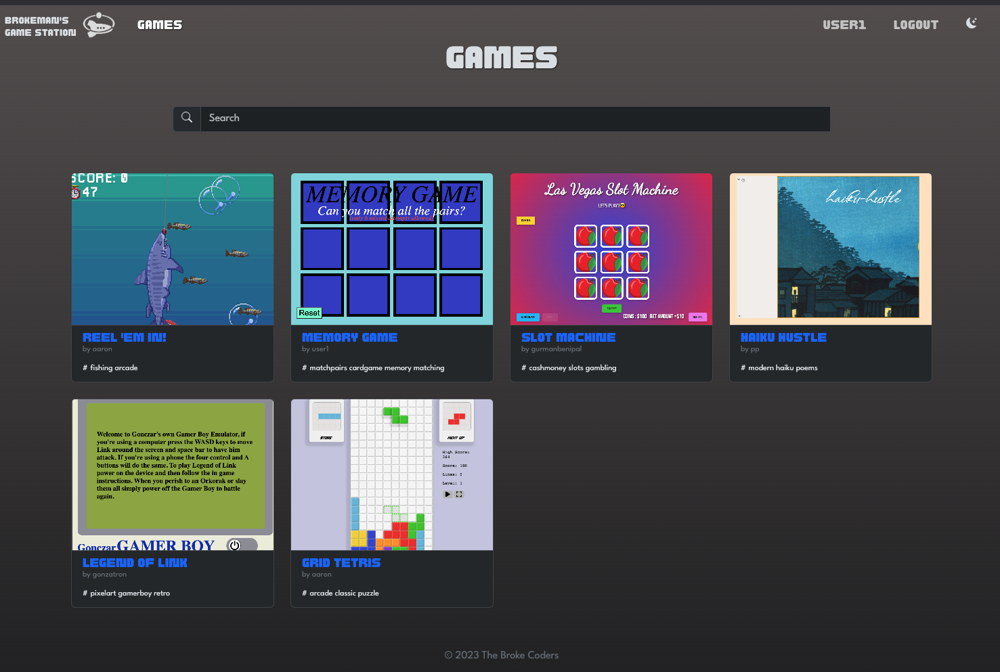
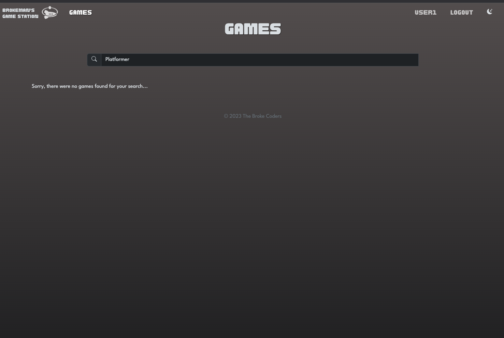
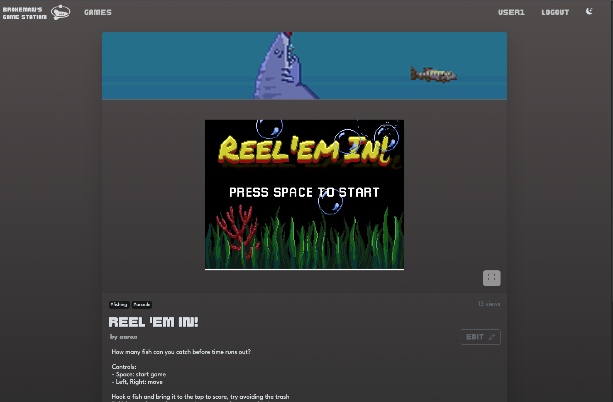

# Brokeman's Game Station


## Getting Started
Click to navigate -> https://brokemans-gamestation-903d50ec6ce7.herokuapp.com/

### HTML5 game hosting & sharing site
How it started: [Wireframe](https://whimsical.com/brokeman-s-wireframe-EQUcPbkTJ9ugSzMAjjwBa8)
[Trello](https://trello.com/b/N7TDLKGa/brokemans-game-station)

## Tools


### Requirements:

- Python version 3.11+

- Python libraries:
  - Django
  - django-environ
  - psycopg2
  - boto3


##


##


##


##


##


## Code Preview

```js
<!-- Edit Modal -->

<div class="modal fade" id="edit-modal" tabindex="-1" role="dialog">
    <div class="modal-dialog modal-dialog-centered" role="document">
        <div class="modal-content">
            <form action="" method="post" id="edit-form">
                
                <div class="modal-header">
                    <h5 class="modal-title" id="edit-title">
                        Edit Review
                    </h5>
                    <button type="button" class="btn close" data-bs-dismiss="modal" aria-label="Close">
                        <i class="bi bi-x-lg"></i>
                    </button>
                </div>
                <div class="modal-body">
                    <label for="edit-text" class="form-label">Content:</label>
                    <textarea id="edit-text" class="form-control mb-4" name="content" rows="10"></textarea>
                    <label for="edit-rating" class="form-label">Rating: </label>
                    <select id="edit-rating" class="form-control" type="number" name="rating">
                        <option value="5">★★★★★</option>
                        <option value="4">★★★★</option>
                        <option value="3">★★★</option>
                        <option value="2">★★</option>
                        <option value="1">★</option>
                        <option value="0">No Rating</option>
                    </select>
                </div>
                <div class="modal-footer">
                    <button class="btn btn-outline-danger position-absolute start-0 bottom-0 mb-3 ms-3" id="delete-review-form-submit-delegate" type="button">Delete</button>
                    <button type="button" class="btn btn-outline-secondary" data-bs-dismiss="modal">Cancel</button>
                    <button type="submit" class="btn btn-success">Submit</button>
                </div>
            </form>
            <form id="delete-review-form" action="" method="POST">
                
                <input type="submit" id="delete-review-form-submit" hidden>
            </form>
        </div>
    </div>
</div>

<script>
    window.addEventListener("load", evt => {
        const deleteFormSubmitEl = document.getElementById("delete-review-form-submit");
        const deleteFormSubmitDelegateEl = document.getElementById("delete-review-form-submit-delegate");

        deleteFormSubmitDelegateEl.addEventListener("click", evt => {
            deleteFormSubmitEl.click();
        });
    });
</script>

```

## Icebox Features

- Add reply function to comments
- Host games on AmazonS3
- Email verification and  Admin's approval for user's game upload(s)
- Antivirus to prevent malicious maleware uploads


## Interested in forking our app? Here are some tips and things you'll need:

A .env file should be located at `bgs/.env` containing
the following:

| Key        | Description                                                                                                     |
|------------|-----------------------------------------------------------------------------------------------------------------|
| SECRET_KEY | Arbitrary string for Django hashing & cryptographic signing.                                                    |
| DEBUG      | "True": Debug mode "False": Production                                                                          |
| DB_NAME    | Name for main postgresql database. Locally hosted for now. Make sure to create this db prior to running server. |
| PORT       | Server port number. Left unspecified, it will default to 3000.                                                  |

Migrate database changes to your local database
```shell
python3 manage.py migrate
```

Run server
```shell
python3 manage.py runserver
```

Optional: Use `do` script shortcut to run commands. Unix-only.
- Make `do` script executable `chmod +x ./do`
- Run python manage.py commands `./do <command>`
